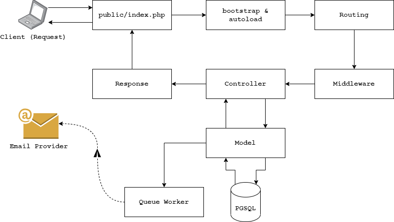

# Levart Test
This is repository of Levart Coding Test


## Installation & Serve

- Clone this repository
- Change directory to repository
- Install dependencies
```bash
composer install
```
- Configuration of some variables in the `app/config/` folder
- After config your database connection, please run the migration
```bash
php app/database/migration.php
```
- Serve the development server
```bash
php serve
```
- To run queue, please run the worker in another terminal tab
```bash
php worker
```

## API Reference

#### Get all mails

```
  GET /api/mails
```

| Parameter | Type     | Description                |
| :-------- | :------- | :------------------------- |
| `per_page` | `Int` | The amount of data to be displayed per page. *Default* is 5 |
| `page` | `Int` | The page number to open. *Default* is 1 |

#### Get mail

```
  GET /api/mails/{id}
```

| Parameter | Type     | Description                       |
| :-------- | :------- | :-------------------------------- |
| `id`      | `Int` | **Required**. Id of mail to fetch |

#### Create mail

```
  POST /api/mails
```

| Body | Type     | Description                       |
| :-------- | :------- | :-------------------------------- |
| `to`      | `String` | **Required**. Destination email address |
| `cc`      | `String` | Destination email address of cc|
| `bcc`      | `String` | Destination email address of bcc |
| `subject`      | `String` | **Required**. Email subject |
| `body`      | `String` | **Required**. Email subject |

> **Note**
> After create, email will be automatically pushed to queue and worker will be send the email. 


## Request Lifecycle
I made this simple framework based on what I know about Laravel. The syntax, code style, variable naming, and logical thinking all stem from there and are all experiences I have. It's very different and not as good as laravel, but this is what I got the best of. You can see the request lifecycle from this framework in the image below:


## What is missing?
- PSR standard and code linter (phpcs).
- Docker and docker-compose.
- Oauth2 for authentication.

## How to reach me?

- Github : [@agungsp](https://www.github.com/agungsp)
- Instagram : [@zhounatic](https://www.instagram.com/zhounatic/)
- Email : <agungsetyopribadi8@gmail.com>
- Phone/WA/Telegram : [0856-5516-5314](tel:085655165314)
